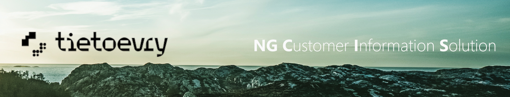

## Nx
- Project is using the Nx https://nx.dev/
- It's the next generation build system with first class monorepo support and powerful integrations.
- Each feature has four types of libraries which are under feature's folder:
  - **Feature** - contains the code for the feature
  - **Data Access** - contains the code for the API calls
  - **UI** - contains the code for the UI
  - **Util** - contains the code for the utilities
- To generate **new library in a feature folder**, run the ``npx nx g @nrwl/angular:lib <library-type> --directory=<feature-folder> --tags=scope:poc,type:<library-type> --skipModule`` command and delete the README file.
  - **library should not contain nested /lib folder.** For example some-feature/util/src/components/my-component.component
- To generate component, run the ``npx nx g @nrwl/angular:component <component-name> --standalone --flat --inlineStyle --inlineTemplate --skipTests`` command and add the ``changeDetection: ChangeDetectionStrategy.OnPush`` to the component's decorator.
  - Depends on the use cases, if the template/styles are too long, just remove the ``--inlineStyle --inlineTemplate`` flags and it'll create separate files for them.
  - By default, there's a rule for creating all components as a **standalone** with **OnPush** change strategy.
- Run the **Graph** of all libraries dependencies via ``npx nx dep-graph``

## Running UI locally
All you need to have installed is [NodeJS](https://nodejs.org/en) on your machine. Recommended is to download the **latest stable version** (LTS) or you can download multiple versions of the NodeJS and install them all - reason for multiple versioning is for supporting [different version of the Angular](https://angular.io/guide/versions) per NodeJS. The command for switching between versions of NodeJS is called [NVM](https://blog.logrocket.com/how-switch-node-js-versions-nvm/).

If you have installed the NodeJS, just do a check if everything went well via ``npm -v``. If it'll print the version you have installed, everything went well.

Then just clone the repo of [cloud-cis-ui](https://dev.azure.com/EnergyUtilities/Cloud%20CIS/_git/cloud-cis-ui) and do the following steps in the command line **inside** the project's folder:
1. Install all dependencies _(**node_modules** folder will be created inside project)_ ``npm i --legacy-peer-deps``
2. Run the project localy _(it'll run local dev server on the http://localhost:4200/ route)_ ``npx nx s``
3. Build project for production via PowerShell script _(it'll run all necessary commands)_ ``./build.sh``
  - ``/dist`` folder will be created, inside **dist** will be ``/app`` folder where are all codes needed for the production. Basically the ``/app`` folder is for the production.
    - There must be an configuration on the server side to make language selection work properly. Correct format for the URL should be ``htttps://<URL>/en`` per language.

## Running backend locally
- Download and install [.NET SDK](https://dotnet.microsoft.com/en-us/download/dotnet/thank-you/sdk-7.0.402-windows-x64-installer)
- Download and install [Visual Studio](https://visualstudio.microsoft.com/downloads/) _(Community version is good enough)_
- Download and install [Docker Desktop](https://www.docker.com/products/docker-desktop/) _(Might need paid version)_
- Clone [cloud-cis-core](https://dev.azure.com/EnergyUtilities/Cloud%20CIS/_git/cloud-cis-core) repo
  - Run the ``.\run-docker-compose.ps1 -Deploy ui-dev -Action build`` for starting the docker containers.
    - Run 'Build' everytime once there's some updates (via git pull). Then just use commands <ins>up</ins> and <ins>down</ins> _('recreate' for up&down)_ for starting/stopping containers in the Docker Desktop.
    - In case of errors in the log, try to run script again. If the error remains after 3 tries, run: ``docker image prune -a -f; docker builder prune -f; docker volume prune -f`` *(for clean docker images)* and run **run-docker-compose** script again. Or you can clear the cache *(faster)* instead of **prune** commands: ``docker compose build api --no-cache``.
    - You can clear everything in git working repository via ``git clean -dfx``.
    - You can also check ``git status`` and if there are some changes, run ``git reset --hard`` and then **run-docker-compose** script again - in case the above commands do not work.
  - Open the solution in Visual Studio for running the tests _(which will generate the test data)_ - note that in the 'Containers' tab in the Docker Desktop all containers **must be running**.
    1. For tests, clone [cloud-cis-test](https://dev.azure.com/EnergyUtilities/Cloud%20CIS/_git/cloud-cis-tests) repository.
    2. Open the solution in the VS: ``./src/Cloud.CIS.Tests.sln``
    3. In the solution go to the ``Tools -> NuGet Package Manager -> Manage NuGet Packages For Solution -> [top right corner] 'Gear Icon'``
       - **"<ins>Package sources:</ins>"** should be:
       - **[nuget.org]** https://api.nuget.org/v3/index.json
       - **[tsu_nugets]** https://artifactory.enu.pub.tds.tieto.com/artifactory/api/nuget/tsu-nuget
       - **[tsu_testing_nugets]** https://artifactory.enu.pub.tds.tieto.com/artifactory/api/nuget/tsu-testautomation-nuget
       - **[cloudcis_nugets]** https://artifactory.enu.pub.tds.tieto.com/artifactory/api/nuget/cloudcis-nugets
       - **[Microsoft Visual Studio Offline Packages]** C:\Program Files (x86)\Microsoft SDKs\NuGetPackages\
    4. In the solution go to the ``Test -> Test Explorer``
        - Under the 'gear icon' in the action bar go to ``Configure Run Settings -> Select Solution Wide runsettings file`` and select the folder of **<ins>/CIS.Tests.Configuration</ins>**
        - Under the 'gear icon' in the action bar go to ``Run Tests In Parallel`` which will _check_ this field _(with this, tests will run quickly - in parallel)_.
        - On the right search, put filter: <ins>Trait:"create"</ins> and now there should be around ~80 tests only.
        - Right-click on the Cis.Core.BackEndTests and press ``Run`` to run all filtered tests.
  - The local swagger will be available on the http://localhost:5000/swagger/index.html route
  - To fire all the requests from the UI to localhost, change values in the ``/apps/poc/src/assets/configuration.local.json`` to:
    - ``"baseApiUrl": "https://localhost:5100"``
    - ``"coreApiPath": "",``
    - ``"pslApiPath": "",``
    - ``"tenantId": "test-dso-company",``

  <ins>**Note:**</ins> Cloud CIS is using MongoDB as a database. So can use [MongoDB Studio](https://studio3t.com/download/) to view containers of the DB. Cloud CIS is also using Kubernetes for running processes in parallel _(so the system could run continuously without stopping)_. 

## Generation of the API client
- For the API stuff are used two libraries:
  - The <ins>**/data-access**</ins> contains main ``/api`` folder with the generated API services for NG CIS ``/cloud-cis-api-client`` and the PAS ``/pas-api-client``.
    - It also contains ``/base`` folder with the all base classes which are wrapping the generated API services. Every generated API service _(agreements.service.ts, invoices.service.ts, ...)_ **must be** wrapped in the base class.
  - The <ins>**/api-models**</ins> contains **only the generated models** and must not depends on any other library.
- For generation itself is used the ``./tools/api-client-generator/generate-api-client.ps1`` script which is using pre-defined file structures in the <ins>***.mustache**</ins> files stored in the ``./tools/api-client-generator/templates`` folder.
  - Simply run ``./generate-api-client.ps1`` without any params. The values are pre-defined with this:
    - $OutputDirectory = **'../../../libs/data-access/src/api/cloud-cis-api-client'**
    - $SwaggerUrl = 'https://api-private.cloudcis-dev.enu.tietoevry.com/core/swagger/v1/swagger.json'
    - $apiModulePrefix = **'CloudCis'**
    - $ModelDir = **'cis-models'**
  
## Uploading/Downloading the translations
- As a UI for translators is used [Traduora](https://traduora.co/) where translations are imported from ``/locales/poc`` folder and then _(once the translation process is completed)_ downloaded into the project _(same directory)_.
- For <ins>**uploading**</ins> the translations, simply run the ``./tools/localization-scripts/upload_localization_traduora.ps1`` script which will upload all translations from the ``/locales/poc`` folder into the Traduora.
- For <ins>**downloading**</ins> the translations, simply run the ``./tools/localization-scripts/download_localization_traduora.ps1`` script which will download all translations from the Traduora into the ``/locales/poc`` folder.
